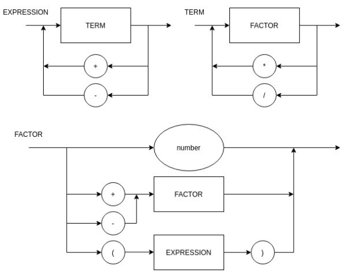

# Status dos testes

## Diagrama sintático

## EBNF

    EXPRESSION = TERM, { ("+" | "-"), TERM } ;
    TERM = FACTOR, { ("*" | "/"), FACTOR } ;
    FACTOR = ("+" | "-") FACTOR | "(" EXPRESSION ")" | number ;
